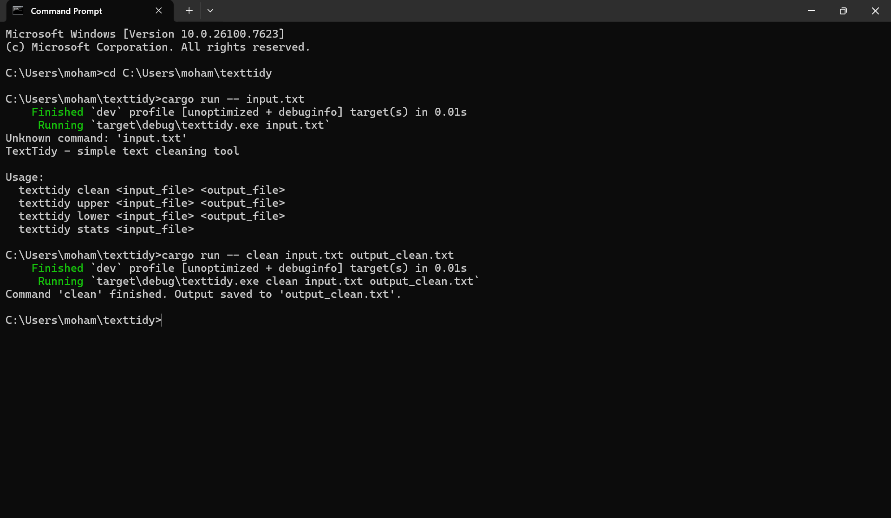

# TextCraftRS

This is a small Rust project I built to practice file handling, string processing, and working with the Rust toolchain.  
The goal of the program is simple: take an input text file, clean up extra spaces, and write the cleaned version to a new file.

I made this project mainly to improve my Rust skills and understand how command‑line tools work.  
It’s not meant to be a big framework or anything — just a practical tool I wrote myself.

---

## What the program does

- Reads a text file line by line  
- Removes extra spaces between words  
- Trims leading and trailing spaces  
- Writes the cleaned text into `output_clean.txt`

I kept the logic simple on purpose so I could focus on learning the basics properly.

---

## How to run it

Make sure you have Rust installed.

Then run:

cargo run -- input.txt

The cleaned output will appear in:

output_clean.txt
---

## Example

**Before:**

Hello     world
This   is    a   test

**After:**

Hello world
This is a test
---

## Why I built this

I wanted to get more comfortable with:

- Rust syntax  
- File I/O  
- String manipulation  
- Structuring a small project  
- Using Cargo  

This project helped me understand these concepts much better.

---

## Future improvements

If I continue working on this, I might add:

- Command‑line flags  
- Custom output file names  
- More cleaning options  
- Error handling improvements  

For now, I’m happy with this version.

---

## Author

Md Rifat Hossain  
Student at THD, learning Rust and building small tools to improve my skills.

## Screenshot

## Download

[Download Linux aarch64 Binary](textcraftrs-aarch64.zip)

